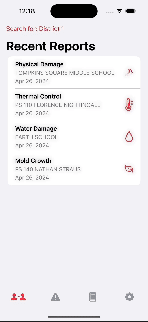

# ICARE NYC
Infrastructure Concerns Assessment & Reporting for Education in NYC

## About

### App details
ICARE NYC is your go-to app for monitoring and addressing infrastructure concerns in New York City’s public schools. Our interface allows you to effortlessly track and report issues, contributing to the improvement of educational environments for students and educators. 

### Author
Aryana Mohammadi

## Accessibility 
We aim to develop an app that is accessible to as many users as possible. 
If you encounter difficulty while using the app, let us know through our [Feedback Form](https://forms.gle/gBsBKWKKh55vokYK6).

### Features
All features align with the user's iPhone settings. No additional configuration required.

- Compatible with dark and light mode
- Compatible with increased contrast mode
- Compatible with English, Spanish, and Traditional Chinese
  - More languages to come
  - AI integration to translate user input to come
- Compatible with VoiceOver
  - Implemented accessibility "Labels," "Hints," and "Traits" to allow for seamless screen reader usage
  - Cells that lead to new pages are marked as buttons
  - Navbar icons are labeled with the pages to which they lead

## Current iteration

